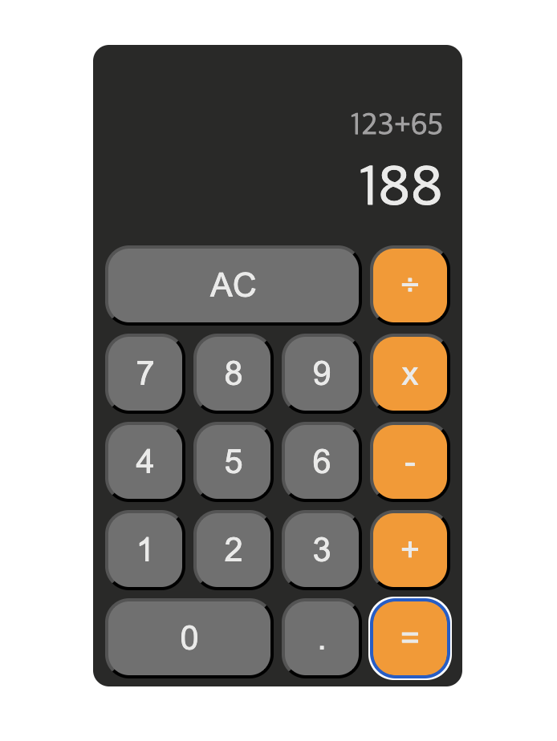

# Vue 계산기

### 목적

- Vue Options API 활용하여 계산기를 구현하면서, 상태 관리와 UI 상호작용을 연습한다.
- 기본적인 사칙연산과 소수점 입력을 처리하고, 계산기의 UI와 상태를 관리하는 방법을 익힌다.

### [👀 배포](https://vue-calc-chi.vercel.app/)

### 미리보기

#### 구현한 기능

- [x] 단일 사칙연산
- [x] 연산 초기화
- [x] 소수점 입력 처리

#### 추가 구현 기능

- [ ] 연속된 연산
- [ ] 부호 전환(+/-)
